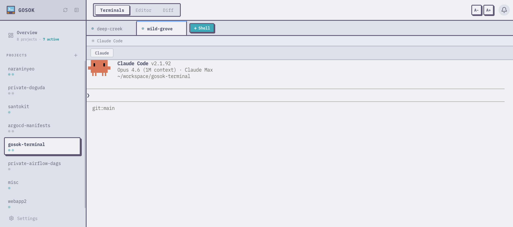
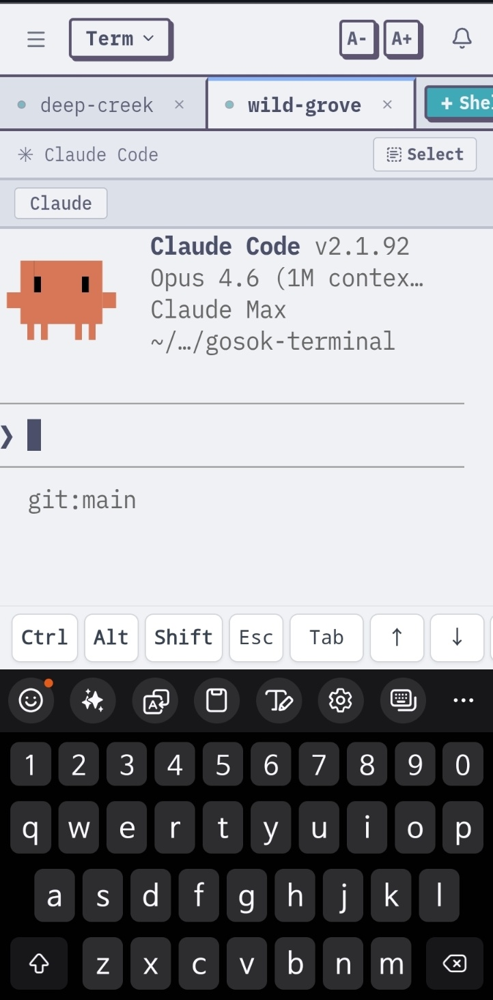

# gosok-terminal

> The name "gosok-terminal" comes from Korean 고속터미널 (gosok-teomineol, Express Bus Terminal). Despite the name, it's not a particularly fast terminal.

A web-based terminal multiplexer with inter-tab messaging. Go backend + React frontend, shipped as a single binary.



**[Documentation](https://cookieshake.github.io/gosok-terminal/)**

## Features

- **Project workspaces** — Organize terminals by project. Shell sessions stay alive when you switch.
- **Tabs** — Multiple shell sessions per project, drag to reorder, restores your last active tab.
- **Inter-tab messaging** — Send messages between tabs via CLI (`msg send`, `msg inbox`, `msg wait`, `msg feed`).
- **Built-in editor** — Monaco-powered file editor with syntax highlighting. Reloads the active file when you switch tabs.
- **Git diff viewer** — Side-by-side diff view for staged and unstaged changes.
- **Notifications** — Browser notifications, toast popups, and a notification center. Use `--flag` to mark a tab as needing attention.
- **Settings UI** — Configure terminal/editor font, text scale, and custom shortcuts from the browser.
- **Mobile support** — Full touch UI: swipe to switch tabs, long-press to reorder, on-screen shortcut bar, text select mode, and virtual keyboard-aware layout.
- **Single binary** — Frontend embedded via `go:embed`. One file to deploy.



## Quick Start

Download the latest binary from [Releases](https://github.com/cookieshake/gosok-terminal/releases), then:

```bash
chmod +x gosok-*

# macOS: remove quarantine attribute
xattr -d com.apple.quarantine gosok-darwin-*

./gosok-darwin-arm64   # or gosok-linux-amd64, etc.
```

Open `http://localhost:18435` in your browser.

### Build from Source

```bash
# Prerequisites: Go 1.25+, Node.js 22+
git clone https://github.com/cookieshake/gosok-terminal.git
cd gosok-terminal
make build
./bin/gosok
```

### Docker

```bash
docker build -t gosok-terminal .
docker run -p 18435:18435 -v gosok-data:/data gosok-terminal
```

> **Security warning:** gosok binds to all interfaces (`0.0.0.0`) by default and has no built-in authentication. Do not expose it to untrusted networks.

### Development

```bash
flox activate       # set up Go + Node.js via Flox
make dev            # backend + frontend with hot reload
make test           # go test ./...
make lint           # go vet + eslint
```

## Example: Two-Tab Workflow

Tabs communicate through inboxes. Here a "runner" tab waits for instructions, and an external script sends it work:

```bash
# --- Terminal A: set up a runner tab ---
proj=$(gosok project create test-run --path /tmp/test | awk '{print $2}')
runner=$(gosok tab create $proj --name runner | awk '{print $2}')
gosok tab start $runner

# Inside the runner tab's shell, run:
#   while msg=$(gosok msg wait --timeout 300s); do echo "Got: $msg"; done

# --- Terminal B: send work and get notified ---
gosok msg send $runner "run tests"
gosok notify "Sent" --body "Message delivered to runner" --flag
```

`msg send` delivers a text message to the tab's inbox -- it does not execute commands. The receiving tab's shell must explicitly read and handle messages (via `gosok msg wait` or `gosok msg inbox`).

## CLI

The `gosok` binary is both the server and the CLI client. Each tab's shell gets `GOSOK_TAB_ID` and `GOSOK_API_URL` automatically.

```bash
# Project management
gosok project list                  # list projects (alias: ps)
gosok project create/update/delete

# Tab management
gosok tab list [project]            # list tabs (alias: ls)
gosok tab create/start/stop/update/delete
gosok tab screen <id> [--lines N]   # read terminal output
gosok tab write <id> "text"         # send text to terminal input

# Messaging
gosok msg send <tab-id> "message"   # direct message (--all to broadcast)
gosok msg inbox [tab-id]            # read inbox
gosok msg wait [--timeout 60s]      # block until message arrives
gosok msg feed ["message"]          # post to or read global feed
gosok msg read [tab-id]             # mark inbox as read

# Other
gosok notify "title" [--body ...] [--flag]
gosok setting list/get/set/delete
gosok help
```

## Environment Variables

| Variable | Default | Description |
|----------|---------|-------------|
| `GOSOK_HOST` | `127.0.0.1` | Bind address (`0.0.0.0` to expose externally) |
| `GOSOK_PORT` | `18435` | Server port |
| `GOSOK_DB_PATH` | `~/.gosok/gosok.db` | SQLite database path |
| `GOSOK_TAB_ID` | _(set by gosok)_ | ULID of the current tab. Set in every shell spawned by gosok. |
| `GOSOK_API_URL` | _(set by gosok)_ | Base URL of the running server. Used by CLI commands inside tabs. |

## Tech Stack

| Layer | Technology |
|-------|-----------|
| Backend | Go, gorilla/websocket, SQLite, creack/pty |
| Frontend | React 19, TypeScript, xterm.js 6, Monaco Editor, TailwindCSS 4, Vite |
| Build | `go:embed` (frontend embedded in binary) |

## License

[MIT](LICENSE)
