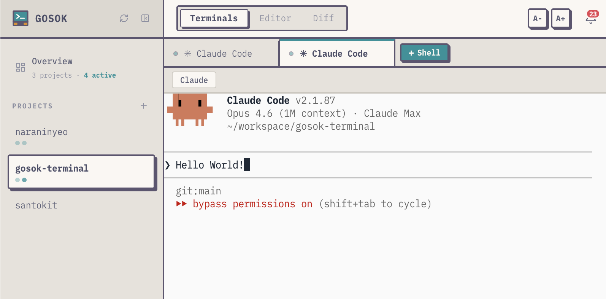

# gosok-terminal

A web-based terminal multiplexer. Manage multiple terminal sessions in your browser, organized by projects.



## Features

- **Project workspaces** — Organize terminals by project. Switch contexts without losing your place.
- **Tabs** — Open multiple terminals side by side, drag to reorder, rename with custom titles.
- **Inter-tab messaging** — Send messages between terminals. Useful for coordinating long-running tasks or AI agents.
- **Notifications** — Get browser notifications when a task finishes. Never miss a completed build again.
- **Built-in editor & diff viewer** — Quick file edits and diffs without leaving the browser.
- **Custom shortcuts** — Bind frequently used commands to keyboard shortcuts.
- **Mobile friendly** — Works on phones and tablets with an on-screen key bar.
- **Single binary** — One file to deploy. Frontend is embedded in the Go binary.
- **Docker ready** — Multi-stage Dockerfile included.

## Quick Start

### From source

```bash
# Prerequisites: Go 1.25+, Node.js 22+
make build
./bin/gosok
```

Open `http://localhost:18435` in your browser.

### Docker

```bash
docker build -t gosok-terminal .
docker run -p 18435:18435 -v gosok-data:/data gosok-terminal
```

## CLI Commands

```bash
gosok                                    # Start the server
gosok help                               # Show help
```

### In-tab messaging (for scripts and agents)

These commands are available inside gosok terminal tabs. `GOSOK_TAB_ID` and `GOSOK_API_URL` are automatically set.

```bash
gosok send <tab-id> <message>            # Send a direct message to a tab
gosok send --all <message>               # Broadcast to all tabs
gosok feed <message>                     # Post to the global feed
gosok feed                               # Read the global feed
gosok inbox [tab-id]                     # Read messages for a tab
gosok notify <title> [--body <text>]     # Send a browser notification
```

## Environment Variables

### Server configuration

| Variable | Default | Description |
|----------|---------|-------------|
| `GOSOK_PORT` | `18435` | Server port |
| `GOSOK_DB_PATH` | `~/.gosok/gosok.db` | SQLite database path |

### Auto-injected in tabs

These are set automatically inside each terminal tab. Used by CLI messaging commands.

| Variable | Description |
|----------|-------------|
| `GOSOK_TAB_ID` | Current tab ID |
| `GOSOK_API_URL` | Server URL |

## Development

```bash
make dev            # Run backend + frontend concurrently
make test           # Run tests
make lint           # Run linters
make build          # Production build
```

## Tech Stack

- **Backend:** Go, SQLite, WebSocket (gorilla/websocket), PTY (creack/pty)
- **Frontend:** React 19, TypeScript, xterm.js, TailwindCSS 4, Vite

## License

[MIT](LICENSE)
