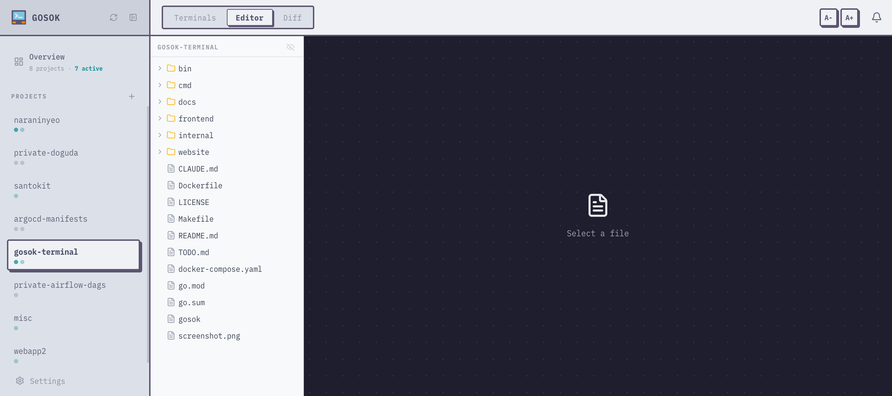

## Editor Mode

Switch to **Editor** mode using the mode switcher in the header. The editor provides:

- **File tree** — browse files in the project directory
- **Monaco editor** — syntax highlighting for 30+ languages
- **Auto-refresh** — files are re-read when switching to editor mode or changing tabs
- **Save** — `Cmd+S` / `Ctrl+S` or click the Save button

The file tree panel is resizable by dragging the divider.

:::note
The editor does not modify files on disk until you explicitly save. Unsaved changes are indicated with a dot (●) on the file tab.
:::

## Diff Mode

Switch to **Diff** mode to view git changes in the project directory.

- Shows changed files (staged and unstaged)
- Side-by-side diff view per file
- Uses the same font and size settings as the editor

## Settings

Font size and family can be adjusted per mode:

- **A-** / **A+** buttons in the header control font size
- Terminal and editor font settings are independent
- Settings persist across sessions via the settings system
