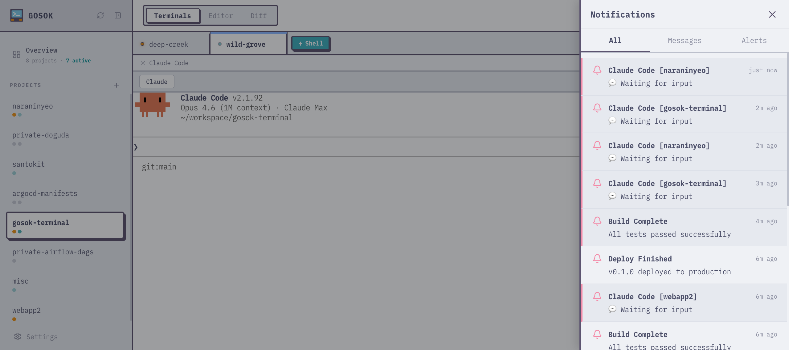

## Overview

gosok has a real-time notification system powered by WebSocket events. Notifications can come from:

- **CLI** — `gosok notify "title" --body "message"`
- **Messages** — `gosok msg send <tab-id> "message"` or `gosok msg feed "message"`



## Notification Center

Click the bell icon in the header to open the notification center panel. It shows:

- **All** — unified feed of messages and notifications
- **Messages** — direct, broadcast, and feed messages
- **Alerts** — notifications sent via `gosok notify`

Unread items have a colored left border (blue for messages, pink for alerts) and a tinted background. Items are marked as read when the panel is closed.

## Toast Notifications

New notifications appear as toast popups in the top-right corner. They auto-dismiss after 4 seconds. Clicking a toast navigates to the associated tab.

## Tab Flagging

By default, `gosok notify` does not visually highlight the tab. To make a tab's dot turn yellow in the sidebar and tab bar:

```bash
gosok notify "Build Complete" --body "All tests passed" --flag
```

The yellow dot persists until the notification is read in the notification center.

## Browser Notifications

If browser notification permission is granted, `gosok notify` also triggers a native OS notification. Permission is requested automatically on the first notification.
