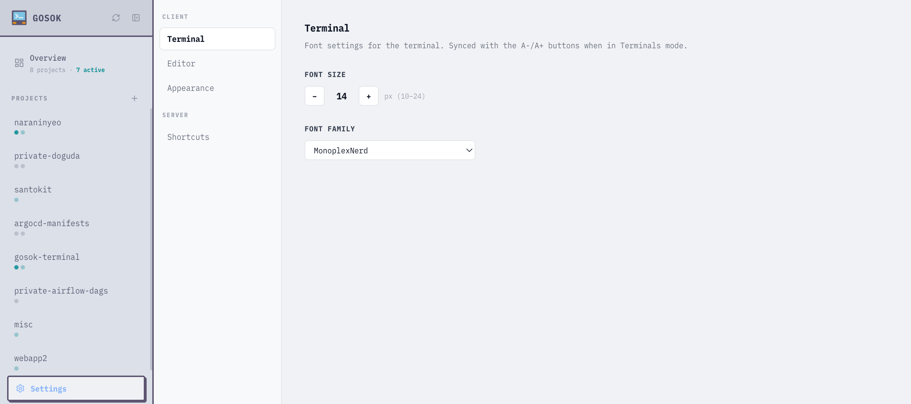

## Overview

Settings control font sizes, font families, and custom shortcuts. They can be managed from the **Settings UI** in the browser or via the **CLI**.

## Settings UI

Click the gear icon in the sidebar to open the settings page. Changes take effect immediately and persist across sessions.



## CLI

```bash
# List all settings
gosok setting list

# Get a specific value
gosok setting get terminal_font_size

# Set a value
gosok setting set terminal_font_size 16

# Reset to default
gosok setting delete terminal_font_size
```

## Available Settings

| Key | Default | Description |
|-----|---------|-------------|
| `terminal_font_size` | `14` | Terminal font size in pixels |
| `terminal_font_family` | `MonoplexNerd, Menlo, ...` | Terminal font family |
| `editor_font_size` | `14` | Editor font size in pixels |
| `editor_font_family` | `MonoplexNerd, Menlo, ...` | Editor font family |
| `text_scale` | `1` | Global text scale multiplier |
| `shortcuts` | `[]` | Custom keyboard shortcuts (JSON array) |
| `ai_tools` | _(see below)_ | AI tool configurations (JSON array) |

## Custom Shortcuts

Add custom shortcut buttons to the terminal header via the Settings UI or CLI:

```bash
gosok setting set shortcuts '[{"label":"Build","command":"make build\\n"}]'
```

Each shortcut has:
- `label` — Button text shown in the header
- `command` — Text sent to the terminal (use `\\n` for Enter)

## AI Tools

Configure which AI coding tools appear in the tab creation menu:

```bash
gosok setting set ai_tools '[{"type":"claude-code","label":"Claude","command":"claude","enabled":true}]'
```

Each tool has:
- `type` — Unique identifier
- `label` — Display name
- `command` — Shell command to run
- `enabled` — Whether it appears in the menu
